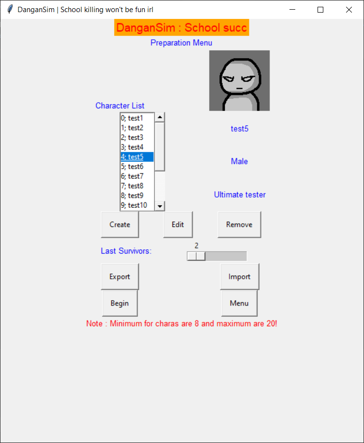
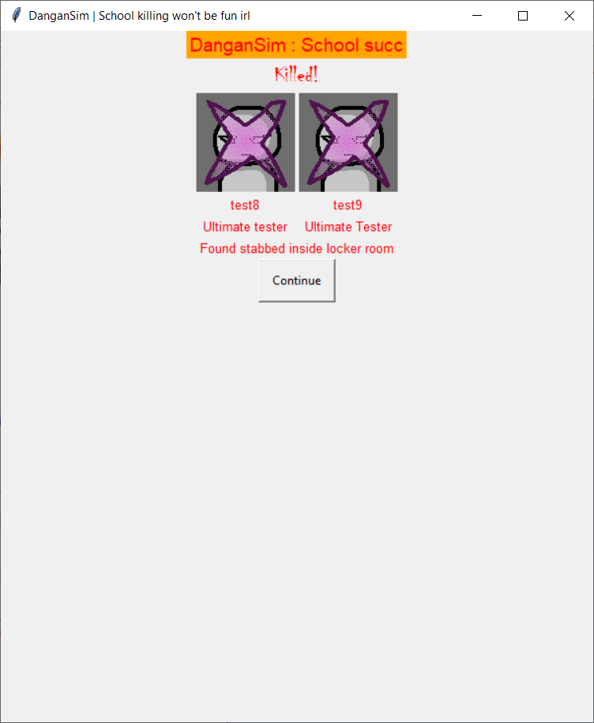
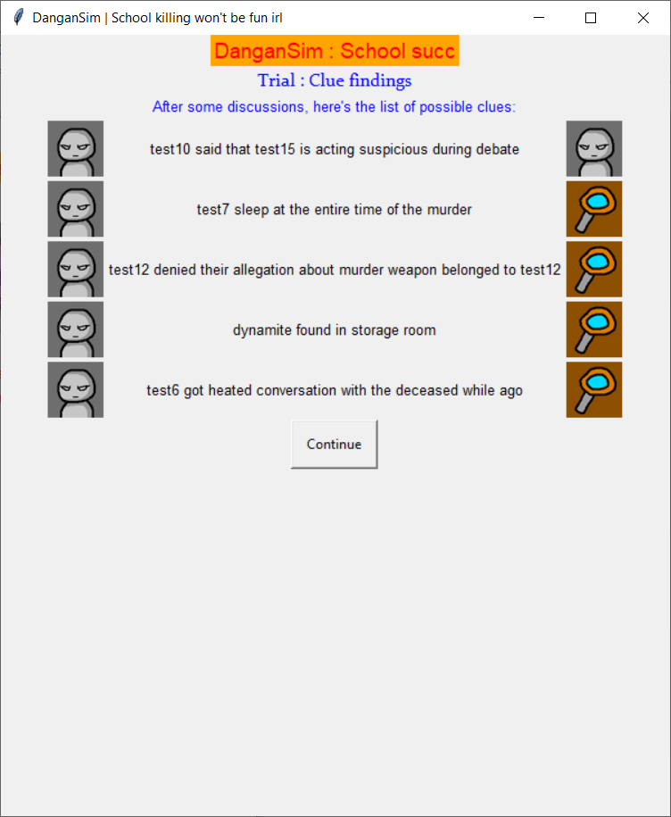
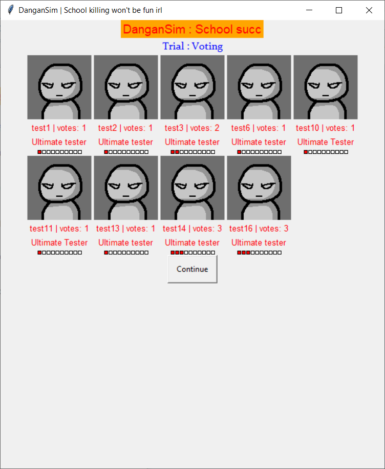

# DanganSim

   

This is **dangan simulator**, where it uhhhhh generates(?) a sequence of events replicating original game, danganronpa

*what this use for?* uhhh create certain school killing scenario? you can spruce up your imagination with this, or uhh having fun with possibilities of your friends dying inside school killing game or somethin idk :(

This app is made in python with [guizero](https://lawsie.github.io/guizero/about/) library (cause i suck at GUI programming)
by yours truly, agarpac!

Some script writeups and sequences based on this [replit talk](https://repl.it/talk/share/Danganronpa-simulator/6602)
I greatly thankful to him for giving me ideas '3'/


## FEATURES:

- View motives and punishments (idk why i added this)

- Character editor to put it into list

- Export import list (so you don't always need to create same set characters every time)


## SETTING UP and MODIFYING:

### Prequisite for running the release

I only built it for Windows (86x) using cx_Freeze.

What you need to run the exec is having **Visual C++ Redistributable for Visual Studio (2015 or 2017)** installed

### Prequisite for running the code

You only need guizero which you can do with:
`pip install guizero`
or refer to this [installation guide](https://lawsie.github.io/guizero/)

using `pip` instead of others will also install [PILLOW](https://pillow.readthedocs.io/en/latest/index.html) which is really needed for image load

if not, do `pip install Pillow`


### Picture for characters
Put your pictures inside of "player" folder inside installation folder. You can select them when you create/edit character in-app

**RECOMENDED TO USE EITHER PNG, GIF, or JP(E)G** (animated picture will turned into first frame image of it),
otherwise check this [PILLOW Doc about Image Format](https://pillow.readthedocs.io/en/latest/handbook/image-file-formats.html) (should work for the most of formats available in there)

### Text files inside
You can try to modify text files inside `asset/` to add, change, or remove sentence(s).

The file name should be **self explanatory** for which is what.
The coolblurb tho, is the additional header on top of the app (sub title?). *you can ignore that*.

*The format is already available for you to adapt, but you can always try to make them different* (as long as you're comfortable with those showed in the app).

If these things exist; `{0} and {1}`, it'll be replaced with student's name. Be sure to make your sentence with either `{0}` or both `{0} {1}` (except for place clue, since it'll be placed alongside with item clue).

for **punishment list**, it has **special symbols** that will be changed from system to something else like these;
| Symbol | Turned into |
|--|--|
| <[1]> | he/she |
| <[2]> | his/her |
| <[3]> | him/her |  

if possible, you shouldn't have empty ENTER space like this:
```
text1
text2
 
```
Otherwise it'll be included in the app as part of the list!


## Notes
- how i implemented this is pretty horrible and due to the nature of guizero, the size is fixed within set pixels there's nothing i can do about it normally

- if there's an update, i might add, modify, or remove lines from assets to my liking

- pls don't remove those assets or the app will not work

  
## Bonus
**change log before this** :

*[3/12/2020]*

- exporting with no .csv at the end will be added by the app itself
[note : even if it's intended to replace written filename (hidden from list), it'll ended up adding .csv]

- limit the maximum of characters to just 20 (already alot and for the sake of my app not dying)

- added special symbols on punishment default list

- punishment preview is modified to reflect that change

- gender value on character data is now used for punishment list

- changed stuffs on investigate-clue screen;

	- from "list of clues" to "list of possible clues" because it's not supposed to always true on each clues (can contradict with each other)

	- added small picture on both sides of each clues to make further gap between clues

- word wrap added for simulation (not on motive and punishment preview)

- changed default window size

- fixed import behaviour when canceling the import

- event1, event2, event3, eventall, clueitem, clueplace, clueword, motivation, and punishment text modified

*[2/12/2020]*

(pls don't read it out of context)

- changed logic to kill people

- changed how to present dead people

- fixed character list shows only first digit on more than one digit index

- fixed survivors value back to 2 after editor mode

- minor adjustments to interface

- motivation and punishment text modified

*[1/12/2020]*

- detect the image format for different handling

- fixed export import function

*[29/11/2020]*

- initial release
